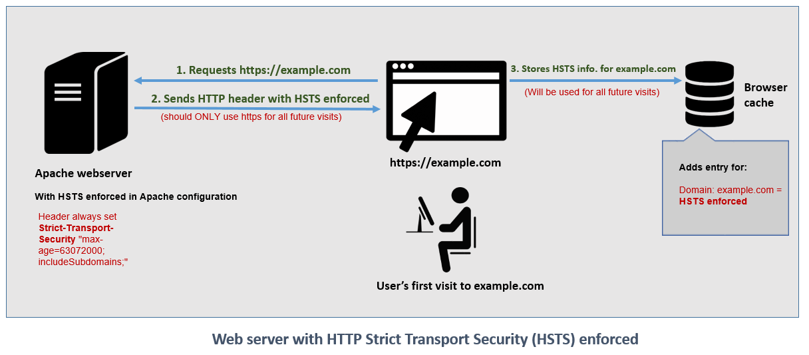

# HSTS-Strict-Transport-Security
HSTS is a feature of HTTP that allows Secuirty Measures During Client Server Communication.

HTTP Strict Transport Security (HSTS) is a web security policy mechanism which helps to protect websites against protocol downgrade attacks and cookie hijacking. It allows web servers to declare that web browsers (or other complying user agents) should only interact with it using secure HTTPS connections,[1] and never via the insecure HTTP protocol. HSTS is an IETF standards track protocol and is specified in

# DFD 

Another Discription are depicted thorugh Visual Representation.

# Nonce Number:
In cryptography, a nonce is an arbitrary number that can only be used once. It is similar in spirit to a nonce word, hence the name. It is often a random or pseudo-random number issued in an authentication protocol to ensure that old communications cannot be reused in replay attacks.

# Why We pay to others For Mining:
 Because we need to validate the Nodes that contains the some transactions.
 The Bitcoin network consists of nodes that all store a database with all transactions, called the block chain. This database consists of a long chain of blocks, each holding one or more transactions. What miners basically do is bundling all unconfirmed transaction into a block. The form of the block must satisfy certain conditions before the block is considered valid. This condition is called proof of work and is not trivial to understand. When a miner finds a block that is valid, it can send its block to the network and others will verify it. When it is indeed valid, all clients will add it to their block chain. Every time a miner finds a valid block, it has the right to assign a certain amount of bitcoins to himself, called the block reward. They also get all transaction fees of all transactions included in his block. This way, new bitcoins are added to the network and it can be ensured that transactions can be confirmed.
 
 

